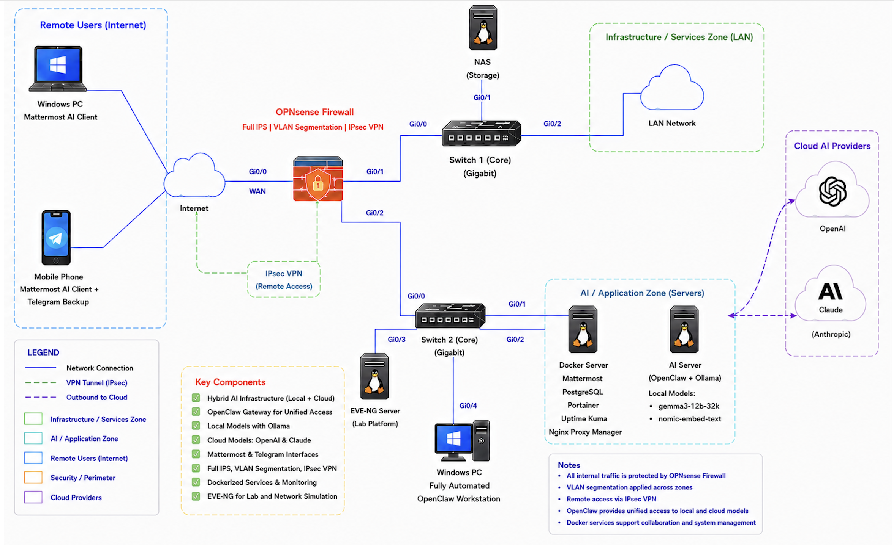
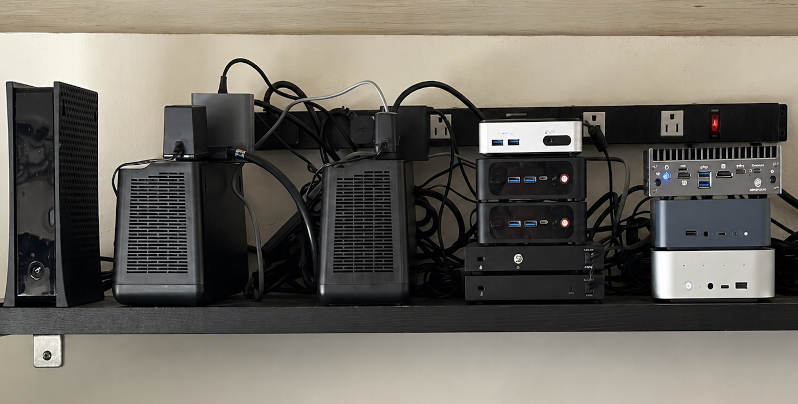
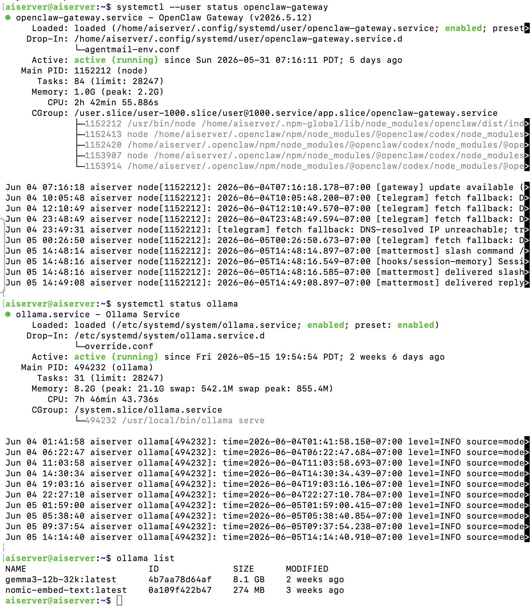
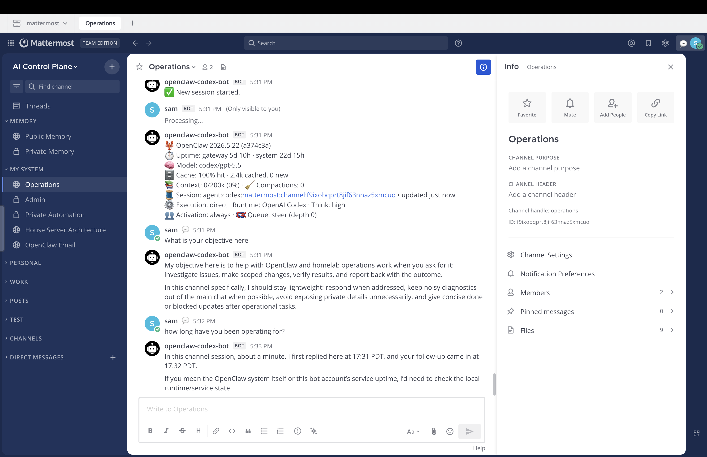
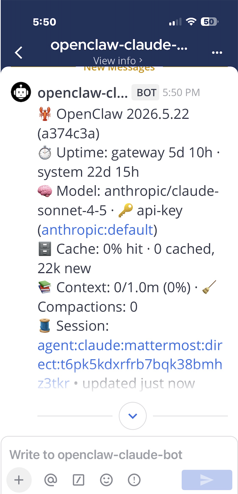

# Lab 1 – Building a Hybrid AI Infrastructure with Local and Cloud Models

## Overview

Most AI deployments force a tradeoff. Use powerful cloud models and your data leaves the network. Run local models and you give up capability. I wanted both. Local inference for privacy-sensitive workloads, cloud providers available when their power is needed, all routed through a single interface behind a segmented network with security controls applied throughout.

This lab documents how I built it. Architecture decisions, what was deployed, and how each component was validated. It is the foundation for a multi-lab series that adds security, resiliency, monitoring, automation, and governance on top of what is established here.

Documented as a validated engineering case note, not a configuration walkthrough.

---

## Objective

Build and validate a hybrid AI environment integrating local and cloud AI models through a unified operational platform supporting desktop and mobile access.

---

## Topology Summary

The environment runs on dedicated hardware across two functional tiers. The AI server hosts OpenClaw as the unified gateway and Ollama as the local inference platform. The Docker server hosts Mattermost and supporting containerized services. Both systems sit behind an OPNsense perimeter firewall on a segmented internal network.

OpenClaw provides a single access layer for all AI providers. Mattermost channels map to individual model routes. Local inference, OpenAI, and Anthropic are each accessible through dedicated channels without separate clients or API session management. Remote access is provided via IPsec VPN. Telegram operates as a secondary access path independent of the primary Mattermost interface.

Network security controls including VLAN segmentation and security enforcement are in place across the environment and will be covered in future labs.

---

## Infrastructure

**Hardware**
- OPNsense Firewall
- Core Switch 1, Core Switch 2 (Gigabit)
- Beelink SER9 HX370 (AI Server)
- EQi12 (Docker Server)
- NAS, EVE-NG Server, Windows PC

**AI Platform**
- OpenClaw 2026.5.22 (a374c3a)
- Ollama
- gemma3-12b-32k, nomic-embed-text
- OpenAI, Anthropic (Claude)

**Interfaces**
- Mattermost Team Edition (primary)
- Telegram (fallback)

---

## Validation

**AI Platform Operational**

OpenClaw gateway confirmed running with over five days of continuous uptime at time of capture. Service is enabled at boot, memory consumption is stable, and active log entries confirm the gateway is processing and delivering requests through the Mattermost integration.

**Local Models Operational**

Ollama inference service confirmed running with nearly three weeks of continuous uptime at time of capture. Both local models are installed and available. gemma3-12b-32k for general inference, nomic-embed-text for embedding workloads.

**Desktop AI Access Operational**

Mattermost AI Control Plane confirmed active with channel-per-model routing operational. The OpenAI-routed bot confirms correct model assignment, active caching, and accurate uptime reporting. Agent behavior verified via direct query.

**Mobile AI Access Operational**

Claude-routed bot confirmed active on the Mattermost mobile client with correct provider routing. Uptime figures consistent with the server-side terminal capture. 

**Cloud AI Integrations Operational**

OpenAI and Anthropic integrations confirmed active through their respective OpenClaw-managed Mattermost channels. Both providers accessible through the same client interface as local models.

---

## Outcome

Successfully deployed and validated a hybrid AI platform providing unified access to local and cloud AI models through a single operational interface supporting desktop and mobile clients.

---

## Lab Roadmap

This project serves as the foundation for broader work to come focused on securing, operating, and governing a production-grade AI platform.

---

## Status

Validated and complete.
